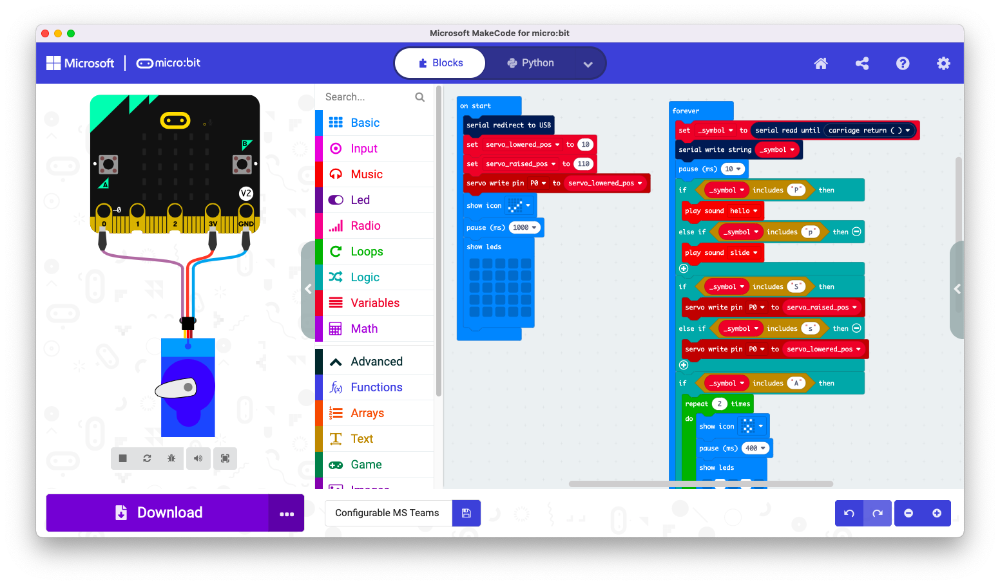
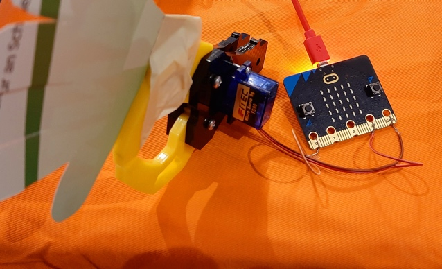
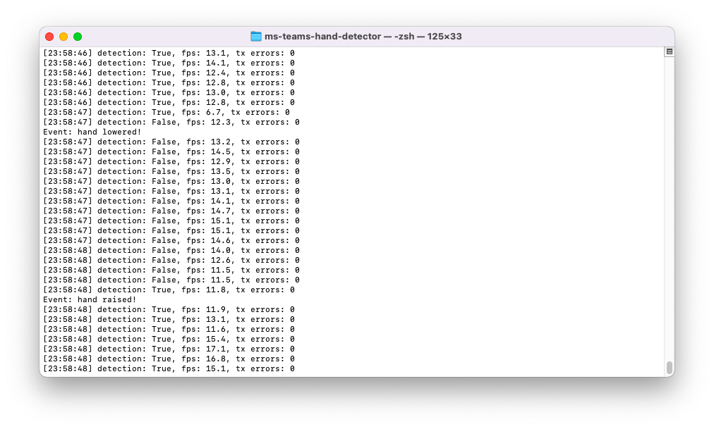

# README

## What is this?

The Python script in this repository detects when meeting participants in Microsoft Teams meetings raise or lower their virtual hand - and takes action to give it more emphasis in the real world. Microsoft did not seem to provide an application programming interface (API) ([Microsoft Q&A: Is there a way to detect raised hand during an online meeting using API](https://docs.microsoft.com/en-us/answers/questions/173770/is-there-a-way-to-detect-raised-hand-during-an-onl.html)), so this project has been started as a workaround. Related: [Microsoft Support: Raise your hand in a Teams meeting / See who has their hand raised](https://support.microsoft.com/en-us/office/raise-your-hand-in-a-teams-meeting-bb2dd8e1-e6bd-43a6-85cf-30822667b372).

There are currently two versions of the Python script: a command-line based one (`cli.py`) and a GUI-based one (`gui.py`). In both cases the detection result is output (to the console via standard output or as a text label in the GUI). Additionally, a string can be sent to a serial device when a hand is raised or lowered. Currently only two state transitions cause those events: *no hand → first hand* and *at least one hand → no hand* (e.g. not also one hand → two hands).

The device being connected to the serial can perform any reaction, e.g. play an animation, make a sound or move a stepper motor - but basically everything is possible. In my case I've used a micro:bit which does all three reactions.

It should be easy to connect different hardware and to implement own actions/reactions to raised/lowered hands (the edge detection is already in use).

It's originally meant for meetings that are "hybrid" - some people take part in presence, some only digitally/online (better wording is welcome; native speakers are welcome to suggest something else). This should allow online participants to become more visible by a group of participants in real-life.

## What isn't this?

This is not about gesture recognition - the script does not detect raised hands from webcam video streams.

## How does it work?

The detection logic is all done in the Python scripts `cli.py`/`gui.py`.

The detection is based on computer vision (OpenCV) pattern matching using a reference symbol. The script regularly takes screenshots and watches out for the raised hand symbol. That also means that the computer where the script is run needs to be connected to the meeting using Microsoft Teams and the list of participants needs to be visible. *(Depending on your operating system you may have to grant the script the rights to take screenshots - this could be hidden in application privacy settings.)*

When a participant raises his or her hand, the script should find out that the symbol is visible on the screen - depending on a specific, configurable threshold value. On change of detection state (hand/ no hand), the script writes a message to the serial interface.

In my case I've used a [BBC micro:bit](https://microbit.org/) to receive and react on the serial data. There is a pre-compiled `.hex` file contained in this repository which can be flashed on a micro:bit v2 (not tested for micro:bit v1 yet).

Depending on the configured serial message that is sent from the PC to the micro:bit, the micro:bit will (in this order)

- play an animation and/or
- move the servo montor and/or
- make a sound

when the first hand is raised or the last hand has been lowered. The source can be accessed under https://makecode.microbit.org/_LpmHpi9oMhXe.






## How can I use it?

There are currently two methods to use this software. One ist to run it using a Python interpreter (recommended at this point in time). The other is to use a [pre-built release](https://github.com/maehw/ms-teams-hand-detector/releases) - executables for Windows, Linux and MacOS are available.

### Prerequisites and dependencies

First of all you need a computer running Microsoft Teams.

Take a screenshot of the raised hand symbol that is shown in Microsoft Teams in the participants list on the right hand side. Then cut it (about 32 x 32 pixels) and place it in the same folder as the Python script. Replace the dummy image file `the-hand.png` (or specify a different name). It is not part of this repository due to copyright uncertainties. Also it may be subject to change in future releases of Microsoft Teams.

You also need Python 3 and some more Python modules (when you do not use the pre-built standalone executables):

Some Python modules are required for taking screenshots and using computer vision to detect the hand (see the `import` statements at the top of the Python script):

```
pip install -r requirements.txt
```

*(Note: `opencv-python` currently needs to be downgraded when creating an executable with PyInstaller; related: https://github.com/maehw/ms-teams-hand-detector/issues/1)*

If you want to react, you may also want to use a BBC micro:bit, but any other hardware should do the trick (e.g. any  Arduino board).


### GUI version

Call the script `gui.py` using Python 3:

```
python3 gui.py
```

Every required setting can be made from within the GUI.


### CLI version

Call the script `cli.py` using Python 3:

The following parameter is required if you want to send messages via serial interface (you can leave it, if output to the console is enough for your use case):

* `-p`: the port of the virtual serial import, e.g. `COM5` or `/dev/cu.usbmodem23542`

Optional arguments are:

* `-t`: the threshold used in the computer vision pattern matching for detecting the hand (the default value of `4.2e6` did the trick for me, but you may add some `print` log-debugging to find the threshold value that suits you)
* `-m`: the monitor number (defaults to `0`)
* `-r`: the name of the image resource (defaults to `the-hand.png`)




#### Example calls

Only output to console (only if `debug = True`):

```
python3 cli.py
```

Output to console and send messages via serial:

```
python3 cli.py -p /dev/cu.usbmodem14202
```

Additionally set a custom threshold value:

```
python3 cli.py -p COM5 -t 23.5e4
```

Additionally select another monitor/display and define the hand symbol image resource:

```
python3 cli.py -p COM5 -t 4.2e6 -m 1 -r the-hand-modified.png
```

## How can I help improving this?

Help me testing this with your specific setup. I am happy for any feedback. There may also be some open issues or ideas - feel free to implement them and contribute.

### Contributing

Feel free to contribute. ;) Any issues and merge requests are welcome.

It would be great if you could run `check_code.py` on your code before you send a merge request.
